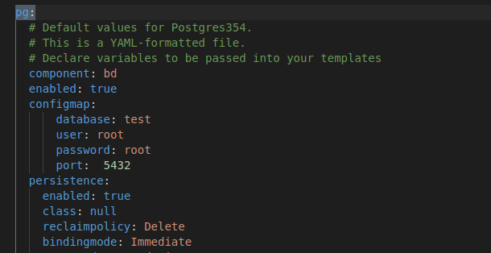
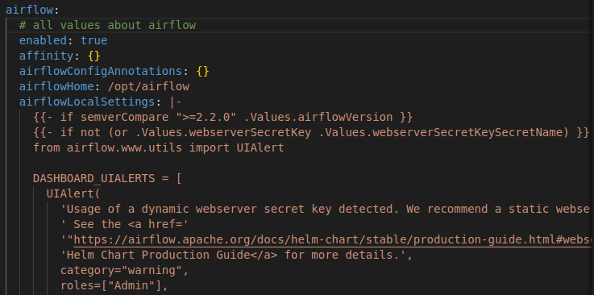
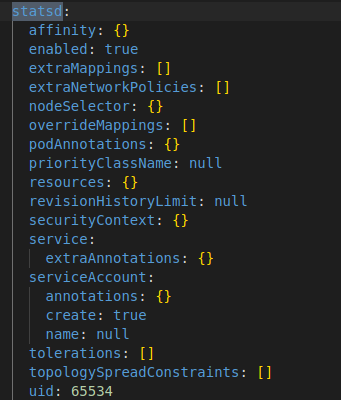
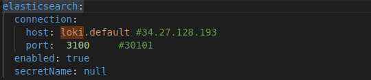
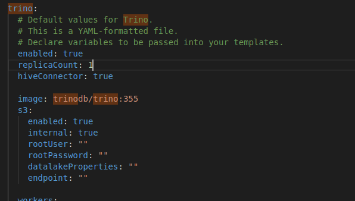
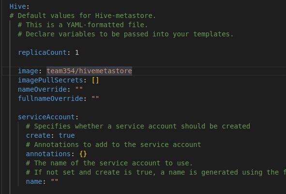
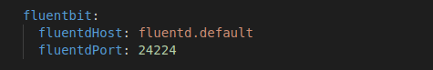
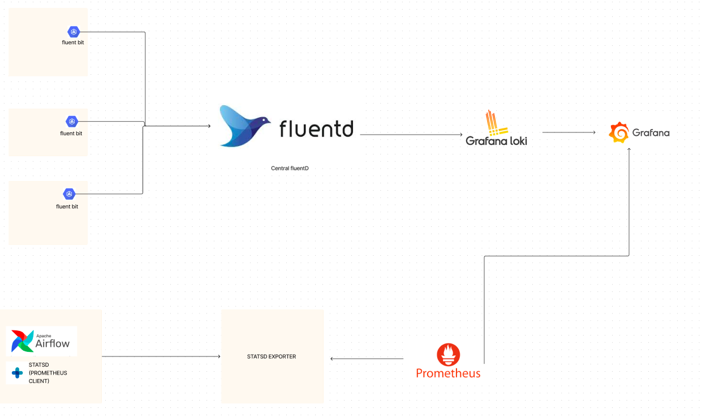

# Helm-charts-codes

## DESCRIPTION

This git repo contains all the files for creating a helm chart to facilitate the deployment of the next stack on k8s:

In addition, it facilitates the deployment on RKE2 from the interface.
The current version (1.0.0) contains the following elements:

- Postgresql
- Minio
- Airflow
- Spark
- airflow
- Trino with HiveMetastore

This version also supports monitoring (metrics and logs) of airflow with stastd (metrics) and fluentbit (logs).

We proceeded in the form of mother and daughter charts. The mother chart is the modernstack chart and it depends on the daughter charts (Minio, Postgres and Trino) with condition to enable or disable one or many daughter charts. First, we created the daughter charts and then the parent chart.

## Minio

We used the official chart produced by Minio (5.0.1) in cluter mode with workers, coordinators, ...

Link for the chart: https://charts.min.io/

## Postgresql

Directory: **Postgresql**
The Postgresql chart, create:
- a pvc
- a service 
- a deployment

In the *values.yaml* file, the options for Postgresql are under the Pg value namespace.

## Airflow
We used the official chart produced by Apache (1.7.0). 
In the *values.yaml* file, the options for Airflow are under the airflow value namespace.

The stastd and statsd-exporter services are enabled to allow the exposure of metrics to Prometheus. 

Logs are sent to loki (can be replaced by elasticsearch)

The docker image used for airflow contains the packages needed to use the sparkSubmitOperator.

## Trino

The trino chart create:
- a configMaps
- a pod for trino CLI
- a service
- a deployement for coordinator
- a statefulset for workers

it depends on the HiveMetastore chart if tag **hiveConnector = True**.

### HiveMetastore

HiveMetastore deploy:
-  a postgresql instance for the metadata
- a service
- a deployement
- a job to initialize metadata base
- a configmap

if **s3.internal=true** (connection with stack minio), the metastore is automatically preconfigured.

otherwise if **s3.internal=false** (connection with another minio or s3), the connection values must be filled in.

otherwise if it is not an s3 service (e.g. gcs or RDBMS), the entire content of the core.xml is expected

## modernstack

mother chart which in addition to deploying daughter charts according to the activation conditions deploys:
- a fluentbit demonset
- a cluster role allowing airflow to create the spark containers
- nodePort services
- redash 

Values for fluentbit config 

## Monitoring

